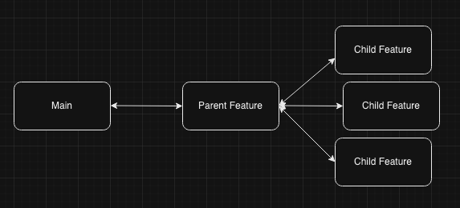

# How to contribute

Government employees, public and members of the private sector are encouraged to contribute to the repository by **forking and submitting a pull request**.

(If you are new to GitHub, you might start with a [basic tutorial](https://help.github.com/articles/set-up-git) and check out a more detailed guide to [pull requests](https://help.github.com/articles/using-pull-requests/).)

Pull requests will be evaluated by the repository guardians on a schedule and if deemed beneficial will be committed to the main branch.

All contributors retain the original copyright to their stuff, but by contributing to this project, you grant a world-wide, royalty-free, perpetual, irrevocable, non-exclusive, transferable license to all users **under the terms of the [license](./LICENSE) under which this project is distributed**.

## Changelog

Developers should update the changelog with each merge into main. The changelog should reference a JIRA ticket number or, if none is associated, provide a detailed explanation of the work. The date should also be provided. No version number is necessary. For example:

```
## April 20, 2024
- Fixed bug that didn't allow users to post [DESENG-123](https://apps.itsm.gov.bc.ca/jira/browse/DESENG-123)
```

Take note of the previous date in the changelog when committing. If the current date is at the top of the file, add a bullet for your changes under that date header.

## Pull Requests

In the PR description field, be sure to include:

- A link to the ticket describing the work
- Description of the changes (if you made any changes that weren't captured in the Jira ticket, be sure to list them here)
- The linked ticket for updating the user guide, if applicable. When functionality changes, we'll want to be sure to update the user guide for MET. Create a separate ticket for this and link it, if necessary. Otherwise, you can just write "N/A"

If a high volume of changes is to be submitted as a PR, we ask that the work be segmented into multiple PRs. A common threshold is that a PR should contain 20 changed files at most. Of course it also depends on the complexity of the changes but we ask that work be broken up into smaller logical chunks whenver possible.

### Examples

1. Let's say you've added 5 new files and made complex changes to 10 others. You also have 5 files that have minor changes in syntax as a result of running the linter. This would be a good place to submit a PR.
2. You have 1 new file added and you may need to make minor changes to syntax or variable names in 25-30 other files. This would be fine to submit as a single PR.

Segmenting a PR is more of an art than a science and PRs typically won't be rejected if they're larger than 20 files. How you segment may be informed by how you choose to branch in git. An example segmentation workflow is provided below.

### Segmentation technique

One common technique used for segmenting PRs is to create a "parent" feature branch off of main. From there, you can create many "child" branches from the parent. A PR is submitted each time you want to merge a child into its parent. A child branch will represent one logical division of the work and, as mentioned above, will contain no more than 20 changed files (depending on complexity of changes).



With this method of segmentation, you don't need to worry about committing incomplete or broken features to main. When all child branches have been completed for the feature, the parent is then merged back into main in a final PR. This final review can contain your CHANGELOG.md entry. In the title or description of your PR, please indicate that all work has already been reviewed.

**Example**: You're tasked with adding a new page to the frontend which requires read access to the DB via a new API route. You create a feature branch off of main, then a child branch off of your feature branch. You then add the new API endpoint required. You submit a PR for this work by requesting to merge your child branch into your parent feature branch. Once merged, you create another child branch off your feature branch and add the new page. You submit this work as its own PR - merging into the parent feature branch again. All work is now complete so you finish things off by submitting a PR to merge your parent feature branch into the main branch. The work has already been approved in previous reviews. You can now choose to update the Changelog. If you need to add any additional, unreviewed work, you can make a note about it in the PR description.

## Merge Techniques

Due to how PRs are commonly segmented in this repository, and due to its active nature, rebasing is discouraged as a way to merge changes. Traditional merge commits are preferred as they preserve history and make it easier to resolve merge conflicts.

## Guidelines for reviewers

Conditions for whether to Approve or Request Changes for a PR can come with a lot of nuance. We try to err on the side of Approve unless there are obvious changes needed. Below is a list of reasons to "stop" a PR. Items with a star next to them are subject to interpretation by the review. Some items may prompt to discussion between the reviewer and the submitting developer so that choices can be justified.

Examples of when to Request Changes

- Logging functions are left in that aren't required or needed later (with exceptions for error logging, i.e. console.error, etc.)
- Commented-code is left in that isn't needed later
- Unsafe function calls like `eval()`
- Widespread incorrect syntax use (using snake case for many variables in JS when it's not required)
- Significant amount of repeition in code that can be condensed without much issue (code isn't DRY) \*
- Unnecessary function calls, overly verbose code \*

## Style Guide

- Avoid using CSS directly. Instead, style through Material UI theming or with CSS-in-JS

## Common Components/Utilities

### MET API

- `@transational`: Database method decorator. If there is an exception during execution, the entire DB session will be safely rolled back to a point in time just before the decorated function was called. If not, the session will be saved, unless autocommit is set to False. This helps replace most session management boilerplate.
- `authorization.check_auth`: Checks a user for one or more roles and for the correct engagement.
- `schema_utils.validate`: The most commonly used method for validating request data in resources. This method takes the request JSON data and compares it to a JSON file that acts as a schema for incoming requests of that type.

### MET Web

- Be sure to make use of shared components found under `src/components/common`. Below is a non-exhaustive list of common app components.
  You can click on the links to view the docblock and source code for each component.
  These components are designed to be used throughout the MET Web application and are styled to match the MET branding.

| Component                                                                                             | Description                                                                                                                   | Import Statement                                                         | Replaces                                    | Usage Example                                                                          |
| ----------------------------------------------------------------------------------------------------- | ----------------------------------------------------------------------------------------------------------------------------- | ------------------------------------------------------------------------ | ------------------------------------------- | -------------------------------------------------------------------------------------- |
| [`Header1`](met-web/src/components/common/Typography/Headers.tsx#L26)                                 | MET-styled h1 component.                                                                                                      | `import { Header1 } from "components/common/Typography"`                 | Level-1 Headers                             | Main titles or headings on pages and sections                                          |
| [`Header2`](met-web/src/components/common/Typography/Headers.tsx#L55)                                 | MET-styled h2 component.                                                                                                      | `import { Header2 } from "components/common/Typography"`                 | Level-2 Headers                             | Subheadings or section titles within a page                                            |
| [`Header3`](met-web/src/components/common/Typography/Headers.tsx#L104)                                | MET-styled h3 component.                                                                                                      | `import { Header3 } from "components/common/Typography"`                 | Level-3 Headers                             | Smaller section titles or subsections within a page                                    |
| [`Header4`](met-web/src/components/common/Typography/Headers.tsx#L141)                                | MET-styled h4 component.                                                                                                      | `import { Header4 } from "components/common/Typography"`                 | Level-4 Headers                             | Minor headings or labels within a section                                              |
| [`EyebrowText`](met-web/src/components/common/Typography/Body.tsx#L82)                                | MET-styled eyebrow text component.                                                                                            | `import { EyebrowText } from "components/common/Typography"`             | Eyebrow text, small headings                | Small headings or introductory text above content, such as "Overview" or "Details"     |
| [`BodyText`](met-web/src/components/common/Typography/Body.tsx#L8)                                    | MET-styled body text component.                                                                                               | `import { BodyText } from "components/common/Typography"`                | Paragraphs, body text                       | Main content text on pages, such as descriptions or instructions                       |
| [`Button`](met-web/src/components/common/Input/Button.tsx#L251)                                       | A versatile button with different style types that are complimentary of MET styling.                                          | `import { Button } from "components/common/Input"`                       | All buttons                                 | Anywhere an action needs to happen on click. See below.                                |
| [`Button` (Primary Variant)](met-web/src/components/common/Input/Button.tsx#L41)                      | A primary button variant, used for the most important actions on a page.                                                      | `import { Button } from "components/common/Input"`                       | PrimaryButtonOld, MetToggleButton           | The primary action on a page or modal; e.g. "Save", "Submit", or "Create"              |
| [`Button` (Secondary Variant)](met-web/src/components/common/Input/Button.tsx#L122)                   | A secondary button variant, used for less important, "default" or "cancel" actions.                                           | `import { Button } from "components/common/Input"`                       | SecondaryButtonOld                          | A secondary action on a page or modal; e.g. "Cancel", "Back", or "Edit"                |
| [`Button` (Tertiary Variant)](met-web/src/components/common/Input/Button.tsx#L203)                    | A tertiary button variant, used for actions the user will not take often, or that are not helpful to draw attention to        | `import { Button } from "components/common/Input"`                       |                                             | A tertiary action on a page or modal; e.g. "Clear selection", "Reset", "Help"          |
| [`FormField`](met-web/src/components/common/Input/FormField.tsx#L18)                                  | A layout component that wraps a form field with a label, error message, and other helpers. Creates consistent form fields.    | `import { FormField } from "components/common/Input"`                    | Most form fields                            | In forms, when consistent field layouts are desired, such as a custom select field.    |
| [`TextInput`](met-web/src/components/common/Input/TextInput.tsx#L49)                                  | A styled text input that can be used in forms. Accepts a `placeholder` and all other props that a MUI TextField would accept. | `import { TextInput } from "components/common/Input"`                    | MUI's TextField component                   | In forms, for text input, such as search fields or as part of a custom form field.     |
| [`TextField`](met-web/src/components/common/Input/TextField.tsx#L142)                                 | A combo of `TextInput` and `FormField` with a label, requirement decorations, `ErrorMessage`s, and many other conveniences.   | `import { TextField } from "components/common/Input"`                    | Most form fields that accept text           | In forms, for labeled text input, such as user registration or profile updates         |
| [`ErrorMessage`](met-web/src/components/common/Typography/Body.tsx#L60)                               | Displays a form validation error message with an exclamation icon. Used when creating a custom form element, e.g. `TextField` | `import { ErrorMessage } from "components/common/Forms"`                 |                                             | Displaying form validation errors in a user-friendly way                               |
| [`Select`](met-web/src/components/common/Input/Select.tsx#L16)                                        | A custom select component that takes an array of options objects and renders a select input. Intended for forms.              | `import { Select } from "components/common/Input"`                       | MUI's Select component                      | In forms, for selecting options from a list, such as categories or statuses            |
| [`DropdownMenu`](met-web/src/components/common/Navigation/DropdownMenu.tsx#L39)                       | A dropdown menu to display a list of buttons. Can be used for navigation or immediate actions. Not a form element.            | `import { DropdownMenu } from "components/common/Navigation"`            | MUI's Menu component                        | Group a set of buttons or links together in a dropdown, leading to actions or pages    |
| [`SystemMessage`](met-web/src/components/common/Layout/SystemMessage.tsx#L9)                          | Displays a message to the user in-page, near the element it applies to. Similar to a callout box in markdown. Dismissable.    | `import { SystemMessage } from "components/common/Indicators"`           |                                             | Highlighting information without creating a modal, such as form errors or instructions |
| [`OutlineBox`](met-web/src/components/common/Layout/index.tsx#L6)                                     | A styled box that displays a rounded outline around its children. Creates visual separation from its surroundings             | `import { OutlineBox } from "components/common/Indicators"`              |                                             | Highlighting content with a rounded outline, such as forms or important sections       |
| [`Detail`](met-web/src/components/common/Layout/Details.tsx#L16)                                      | Used to group related information together, such as in a details page. Similar to OutlineBox, but less visually prominent.    | `import { Detail } from "components/common/Details"`                     |                                             | Grouping related information, such as in a details page or section, or a form          |
| [`DetailsContainer`](met-web/src/components/common/Layout/Details.tsx#L42)                            | A container for Details that provides a consistent layout and styling, and a dark background for the Details to show up on.   | `import { DetailsContainer } from "components/common/Details"`           |                                             | Wrapping multiple Details components to create a cohesive section                      |
| [`EngagementStatusChip`](met-web/src/components/common/Indicators/StatusChip.tsx#L26)                 | A wrapper around MUI's Chip that's styled to display different engagment statuses (Open, Closed, Upcoming, etc)               | `import { EngagementStatusChip } from "components/common/Indicators"`    | Custom status chips                         | Display engagement status in a visually appealing way                                  |
| [`StatusChipSkeleton`](met-web/src/components/common/Indicators/StatusChip.tsx#L99)                   | A skeleton loader for the EngagementStatusChip.                                                                               | `import { StatusChipSkeleton } from "components/common/Indicators"`      |                                             | Show a loading state for engagement status chips                                       |
| [`ImageUpload`](met-web/src/components/imageUpload/index.tsx#L23)                                     | A styled file uploader component specifically for images.                                                                     | `import { ImageUpload } from 'components/imageUpload';`                  | FileUpload, where only images are expected  | Allow users to upload images in forms or content creation                              |
| [`ConfirmModal`](met-web/src/components/common/Modals/ConfirmModal.tsx#L16)                           | A common, reusable modal window type for confirmations.                                                                       | `import { ConfirmModal } from "components/common/Modal"`                 | Other confirmation modals, window.confirm() | Confirming user actions, such as deletions or submissions                              |
| [`BreadcrumbTrail`](met-web/src/components/common/Navigation/Breadcrumb.tsx#L13)                      | A component that displays a breadcrumb trail for navigation.                                                                  | `import { BreadcrumbTrail } from "components/common/Breadcrumbs"`        | Manually created trails                     | Displaying navigation breadcrumbs in a static manner                                   |
| [`AutoBreadcrumbs`](met-web/src/components/common/Navigation/Breadcrumb.tsx#L63)                      | Automatically generates breadcrumbs based on the current route and its parents.                                               | `import { AutoBreadcrumbs } from "components/common/Breadcrumbs"`        | Manually created trails                     | Displaying navigation breadcrumbs dynamically based on the current route               |
| [`Link`](met-web/src/components/common/Navigation/Link.tsx#L16)                                       | A wrapper around MUI's Link, styled for MET.                                                                                  | `import { Link } from "components/common/Navigation"`                    | MUI's Link component, <a> tags              | Navigation links that need to be styled according to MET branding                      |
| [`UnsavedWorkConfirmation`](met-web/src/components/common/Navigation/UnsavedWorkConfirmation.tsx#L11) | Uses a route blocker to display a ConfirmModal for unsaved work.                                                              | `import { UnsavedWorkConfirmation } from "components/common/Navigation"` |                                             | Preventing users from losing unsaved work when navigating away from a page             |
| [`StatusIcon`](met-web/src/components/common/Communication/StatusIcon.tsx#L27)                        | A simple component that shows a styled status icon based on the status passed.                                                | `import { StatusIcon } from "components/common/Indicators"`              | Icons showing an item's status              | Displaying status indicators, such as success, error, or warning                       |
| [`FormStep`](met-web/src/components/common/Layout/FormStep.tsx#L16)                                   | A wrapper for form fields that takes a completion criterion and optional step #. Displays step #, or a checkmark if completed | `import { FormStep } from "components/common/Forms"`                     |                                             | Displaying form steps with progress indicators, such as in multi-step forms            |
| [`Pagination`](met-web/src/components/common/Input/Pagination.tsx#L20)                                | Provides a pagination UI - a wrapper around Material UI's pagination.                                                         | `import { Pagination } from "components/common/Input"`                   | MUI's Pagination component                  | Display paginated data, such as lists or tables                                        |
| [`WidgetPicker`](met-web/src/components/engagement/admin/create/widgets/index.tsx#)                   | A picker component that allows admins to select a Widget for a specified location within the public engagement page           | `import { WidgetPicker } from "components/common/Widgets"`               |                                             | In the engagement editor, allowing users to select and add widgets to their engagement |
| [`ResponsiveContainer`](met-web/src/components/common/Layout/index.tsx#L18)                           | A container that decreases its padding on smaller screens.                                                                    | `import { ResponsiveContainer } from "components/common/Layout"`         | Manual padding on pages                     | Wrap content that should be responsive to screen size changes                          |
| [`ResponsiveWrapper`](met-web/src/components/common/Layout/index.tsx#L39)                             | A route wrapper that adds a responsive container around its child routes.                                                     | `import { ResponsiveWrapper } from "components/common/Layout"`           |                                             | Wrap routes that need responsive behavior                                              |
| [`RichTextEditor`](met-web/src/components/common/RichTextEditor/index.tsx#L28)                        | A WYSIWYG editor used app-wide. Customized to display with MET branding.                                                      | `import { RichTextEditor } from "components/common/RichTextEditor"`      | Any unstyled rich text editor               | In forms, content creation, and anywhere rich text input is needed                     |
| [`RichTextArea`](met-web/src/components/common/Input/RichTextArea.tsx#28)                             | A rich text area used app-wide. Customized to display with MET branding.                                                      | `import { RichTextArea } from "components/common/Input"`                 | Any unstyled rich text area                 | Display rich text content that was created with `RichTextEditor`                       |

The following components are available for use, but still need some work before they can
be considered in-line with the overall MET Web design system. They may not have the same level
of styling or functionality as the components listed above. Some of these components may be
deprecated until they can be updated to meet the design standards. They are marked with a star (\*).

| Component                                                                                                       | Description                                                              | Import Statement                                                                    | Replaces | Usage Example                                                                           |
| --------------------------------------------------------------------------------------------------------------- | ------------------------------------------------------------------------ | ----------------------------------------------------------------------------------- | -------- | --------------------------------------------------------------------------------------- |
| [`EmailModal`](met-web/src/components/common/Modals/EmailModal.tsx#L25)                                         | A reusable modal window type for sending emails.                         | `import { EmailModal } from "components/common/Modal"`                              |          | Collecting/sending emails from within the application                                   |
| [`UpdateModal`](met-web/src/components/common/Modals/UpdateModal.tsx#L16)                                       | A reusable modal window type for updates.                                | `import { UpdateModal } from "components/common/Modal"`                             |          | Displaying updates or notifications to users                                            |
| [`FileUpload`](met-web/src/components/common/FileUpload/index.tsx#L16)                                          | A file uploader component.                                               | `import { FileUpload } from 'components/common/FileUpload';`                        |          | Allow users to upload files in forms or content creation                                |
| [`IconButton`](met-web/src/components/common/Input/Button.tsx#L298)                                             | A button with an icon, used for actions that are represented by an icon. | `import { IconButton } from "components/common/Input"`                              |          | In compact layouts where the action is clear from just the icon, e.g. "Close", "Delete" |
| \* [`ControlledTextField`](met-web/src/components/common/ControlledInputComponents/ControlledTextField.tsx#L16) | A controlled text field component that integrates with React Hook Form.  | `import { ControlledTextField } from "components/common/ControlledInputComponents"` |          | In forms, when using React Hook Form for controlled inputs                              |
| \* [`ControlledSelect`](met-web/src/components/common/ControlledInputComponents/ControlledSelect.tsx#L10)       | A controlled select component that integrates with React Hook Form.      | `import { ControlledSelect } from "components/common/ControlledInputComponents"`    |          | In forms, when using React Hook Form for controlled selects                             |
| \* [`ControlledCheckbox`](met-web/src/components/common/ControlledInputComponents/ControlledCheckbox.tsx#L16)   | A controlled checkbox component that integrates with React Hook Form.    | `import { ControlledCheckbox } from "components/common/ControlledInputComponents"`  |          | In forms, when using React Hook Form for controlled checkboxes                          |
| [`MetDraggable`](met-web/src/components/common/Dragdrop/index.tsx#L50)                                          | A wrapper around the Draggable component from @hello-pangea/dnd.         | `import { MetDraggable } from "components/common/Dragdrop"`                         |          | In drag-and-drop interfaces, to create draggable items                                  |
| [`MetDroppable`](met-web/src/components/common/Dragdrop/index.tsx#L12)                                          | A wrapper around the Droppable component from @hello-pangea/dnd.         | `import { MetDroppable } from "components/common/Dragdrop"`                         |          | In drag-and-drop interfaces, to create drop zones for draggable items                   |
| [`MetTable`](met-web/src/components/common/Table/index.tsx#L96)                                                 | A wrapper around MUI's Table component with MET styling.                 | `import { MetTable } from "components/common/Table"`                                |          | In tables, to create a styled table with headers and rows                               |
