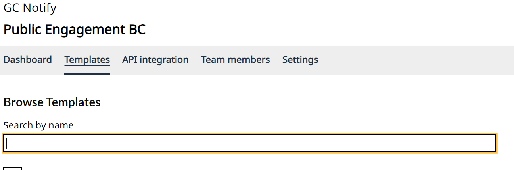
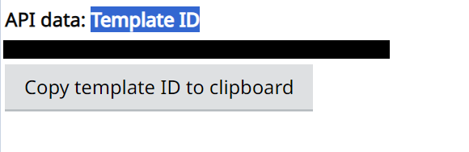

Logging into GC Notify:

- Log in to GC Notify.

Accessing Templates:

- Click on the "Templates" section.

Finding the Template ID:

- Select a template, and then scroll down to find the Template ID.

Using the Template ID:

- Use the Template ID you found in the previous step within your configuration files.

Creating a New Template:

- If you need to create a new template, click the button located at the bottom of the page within the "Template" tab.

- For information on formatting emails, please refer to the following link: https://notification.canada.ca/formatting-emails
- To include custom content in emails, you can find more details at: https://notification.canada.ca/sending-custom-content