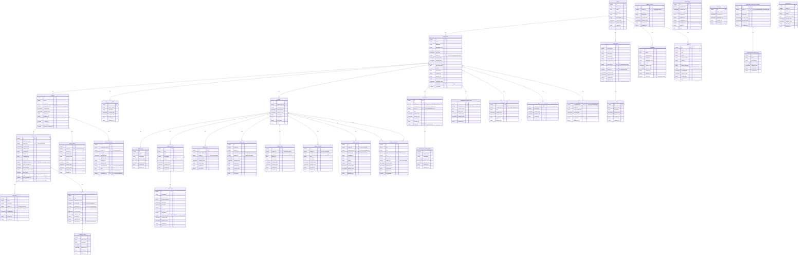

```mermaid
erDiagram
    engagement {
        integer id PK
        string name
        string description
		string description_title
        timestamp start_date
        timestamp end_date
        integer status_id FK "The id from engagement status"
        timestamp created_date
        timestamp updated_date
		timestamp published_date
        json rich_description
        string content
        json rich_content
        string created_by
        string updated_by
        string banner_filename
        timestamp scheduled_date
        integer tenant_id FK "The id from tenant"
        boolean is_internal
    }
    survey {
        integer id PK
		string name
        jsonb form_json
        integer engagement_id FK "The id from engagement"
        timestamp created_date
        timestamp updated_date
        string created_by
        string updated_by
        integer tenant_id FK "The id from tenant"
        boolean is_hidden
        boolean is_template
        boolean generate_dashboard
    }
    engagement only one to one survey : has
    engagement_status {
        integer id PK
        string status_name
        string description
        timestamp created_date
        timestamp updated_date
        string created_by
        string updated_by
    }
    engagement only one to one engagement_status : has
    tenant {
        integer id PK
        string short_name
        string name
        string description
        string title
        string hero_image_url
        timestamp created_date
        timestamp updated_date
        string created_by
        string updated_by
    }
    tenant only one to zero or more engagement : has
    widget {
        integer id PK
        integer widget_type_id FK
        integer engagement_id FK
        timestamp created_date
        timestamp updated_date
        string created_by
        string updated_by
        integer sort_index
        string title
    }
    engagement only one to zero or more widget : has
    widget_type {
        integer id PK
        string name UK
        string description
        timestamp created_date
        timestamp updated_date
        string created_by
        string updated_by
    }
    widget only one to one widget_type : has
    widget_events {
        integer id PK
        string title
        type type
        integer sort_index
        integer widget_id FK "The id from widget"
        timestamp created_date
        timestamp updated_date
        string created_by
        string updated_by
    }
    widget only one to zero or more widget_events : has
    widget_item {
        integer id PK
        integer widget_data_id
        integer widget_id FK "The id from widget"
        timestamp created_date
        timestamp updated_date
        string created_by
        string updated_by
        integer sort_index
    }
    widget only one to zero or more widget_item : has
    widget_map {
        integer id PK
        double longitude
        double latitude
        integer engagement_id FK "The id from engagement"
        integer widget_id FK "The id from widget"
        timestamp created_date
        timestamp updated_date
        string created_by
        string updated_by
        string marker_label
        string geojson
        string file_name
    }
    widget only one to zero or more widget_map : has
    widget_video {
        integer id PK
        integer widget_id FK "The id from widget"
        integer engagement_id FK "The id from engagement"
        string video_url
        string description
        timestamp created_date
        timestamp updated_date
        string created_by
        string updated_by
    }
    widget only one to zero or more widget_video : has
    widget_timeline {
        integer id PK
        integer widget_id FK "The id from widget"
        integer engagement_id FK "The id from engagement"
        string title
        string description
        timestamp created_date
        timestamp updated_date
        string created_by
        string updated_by
    }
    widget only one to zero or more widget_timeline : has
    timeline_event {
        integer id PK
        integer widget_id FK "The id from widget"
        integer engagement_id FK "The id from engagement"
        integer timeline_id FK "The id from timeline"
        string description
        string time
        enum status
        integer position
        timestamp created_date
        timestamp updated_date
        string created_by
        string updated_by
    }
    widget only one to zero or more timeline_event : has
    widget_documents {
        integer id PK
        string title
        string type
        integer parent_document_id FK "References id"
        string url
        integer sort_index
        integer widget_id FK "The id from widget"
        timestamp created_date
        timestamp updated_date
        string created_by
        string updated_by
        boolean is_uploaded
    }
    widget only one to zero or more widget_documents : has
	widget_listening {
        integer id PK
        integer widget_id FK "The id from widget"
        integer engagement_id FK "The id from engagement"
        string description
        timestamp created_date
        timestamp updated_date
        string created_by
        string updated_by
    }
    widget only one to zero or more widget_documents : has
    user_status {
        integer id PK
        string status_name
        string description
        timestamp created_date
        timestamp updated_date
        string created_by
        string updated_by
    }
    subscription {
        integer id PK
        boolean is_subscribed
        timestamp created_date
        timestamp updated_date
        string created_by
        string updated_by
        integer engagement_id
        integer participant_id FK "The id from participant"
        string project_id
        type type
    }
    submission {
        integer id PK
        jsonb submission_json
        integer survey_id FK "The id from survey"
        timestamp created_date
        timestamp updated_date
        string created_by
        string updated_by
        string reviewed_by
        timestamp review_date
        integer comment_status_id FK "The id from comment_status"
        boolean has_personal_info
        boolean has_profanity
        string rejected_reason_other
        boolean has_threat
        integer engagement_id FK "The id from engagement"
        boolean has_personal_info
        integer participant_id FK "The id from participant"
    }
    survey only one to zero or more submission : has
    staff_users {
        integer id PK
        string first_name
        string middle_name
        string last_name
        string username
        string email_address
        string contact_number
        string external_id UK "The id from keycloak"
        integer status_id FK "The id from user_status"
        integer tenant_id FK "The id from tenant"
        timestamp created_date
        timestamp updated_date
        string created_by
        string updated_by
    }
    tenant only one to zero or more staff_users : has
    staff_users only one to one user_status : has
    staff_note {
        integer id PK
        string note
        string note_type
        integer survey_id FK "The id from survey"
        integer submission_id FK "The id from submission"
        timestamp created_date
        timestamp updated_date
        string created_by
        string updated_by
    }
    submission only one to zero or more staff_note : has
    report_setting {
        integer id PK
        integer survey_id FK "The id from survey"
        string question_id
        string question_key
        string question_type
        string question
        boolean display
        timestamp created_date
        timestamp updated_date
        string created_by
        string updated_by
    }
    survey only one to zero or one report_setting : has
    participant {
        integer id PK
        string email_address
        timestamp created_date
        timestamp updated_date
        string created_by
        string updated_by
    }
    membership_status_codes {
        integer id PK
        string status_name
        string description
        timestamp created_date
        timestamp updated_date
        string created_by
        string updated_by
    }
    membership {
        integer id PK
        integer status FK "The id from membership_status_codes"
        integer engagement_id FK "The id from engagement"
        integer user_id FK "The id from staff_users"
        type type
        timestamp created_date
        timestamp updated_date
        string created_by
        string updated_by
        integer tenant_id FK "The id from tenant"
    }
    engagement only one to zero or many membership : has
    membership only one to one membership_status_codes : has
    generated_document_type {
        integer id PK
        string name
        string description
        timestamp created_date
        timestamp updated_date
        string created_by
        string updated_by
    }
    generated_document_template {
        integer id PK
        integer type_id FK "The id from generated_document_type"
        string hash_code UK
        string extension
        timestamp created_date
        timestamp updated_date
        string created_by
        string updated_by
    }
    generated_document_template only one to one generated_document_type : has
    feedback {
        integer id PK
        type rating
        type comment_type
        string comment
        string submission_path
        type source
        timestamp created_date
        timestamp updated_date
        string created_by
        string updated_by
        integer tenant_id FK "The id from tenant"
    }
    tenant only one to zero or many feedback : has
    event_item {
        integer id PK
        string description
        string location_name
        string location_address
        timestamp start_date
        timestamp end_date
        string url
        string url_label
        integer sort_index
        integer widget_events_id FK "The id from widget_events"
        timestamp created_date
        timestamp updated_date
        string created_by
        string updated_by
    }
    widget_events only one to zero or many event_item : has
    engagement_status_block {
        integer id PK
        integer engagement_id FK "The id from engagement"
        type survey_status
        json block_text
        timestamp created_date
        timestamp updated_date
        string created_by
        string updated_by
    }
    engagement only one to many engagement_status_block : has
    engagement_slug {
        integer id PK
        integer engagement_id FK "The id from engagement"
        string slug
        timestamp created_date
        timestamp updated_date
        string created_by
        string updated_by
    }
    engagement only one to one engagement_slug : has
    engagement_settings {
        integer engagement_id PK, FK "The id from engagement"
        boolean send_report
        timestamp created_date
        timestamp updated_date
        string created_by
        string updated_by
    }
    engagement only one to one engagement_settings : has
    engagement_metadata {
        integer engagement_id PK, FK "The id from engagement"
        string project_id
        jsonb project_metadata
        timestamp created_date
        timestamp updated_date
        string created_by
        string updated_by
    }
    engagement only one to one engagement_metadata : has
    email_verification {
        integer id PK
        string verification_token
        integer survey_id FK "The id from survey"
        boolean is_active
        timestamp created_date
        timestamp updated_date
        string created_by
        string updated_by
        integer submission_id FK "The id from submission"
        type type
        integer tenant_id FK "The id from tenant"
        integer participant_id FK "The id from participant"
    }
    survey only one to zero or many email_verification : has
    email_queue {
        integer id PK
        integer entity_id
        string entity_type
        string action
        type notification_status
        timestamp created_date
        timestamp updated_date
        string created_by
        string updated_by
    }
    contact {
        integer id PK
        string name
        string title
        string email
        string phone_number
        string address
        string bio
        string avatar_filename
        integer tenant_id FK "The id from tenant"
        timestamp created_date
        timestamp updated_date
        string created_by
        string updated_by
    }
    tenant only one to zero or many contact : has
    comment_status {
        integer id PK
        string status_name UK
        string description
        timestamp created_date
        timestamp updated_date
        string created_by
        string updated_by
    }
    comment {
        integer id PK
        string text
        timestamp submission_date
        integer survey_id FK "The id from survey"
        integer submission_id FK "The id from submission"
        string component_id
        timestamp created_date
        timestamp updated_date
        string created_by
        string updated_by
        integer participant_id FK "The id from participant"
    }
    comment only one to one comment_status : has
    submission only one to zero or many comment : has
```
