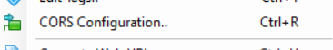
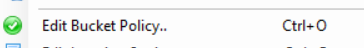

# Setting up a new bucket for document storage

1. Begin by creating a new bucket.

2. Next, right-click on the newly created bucket and select "CORS Configuration."

      

3. In the CORS Configuration, include the new web URL as an allowed origin, specifying the necessary allowed methods. Ensure that any new vanity URLs are added to this list as well.

4. To update the bucket policy and incorporate the necessary policy settings, right-click on the bucket and choose "Edit Bucket Policy."

      

5. Lastly add the new bucket in the s3 objectstore config
