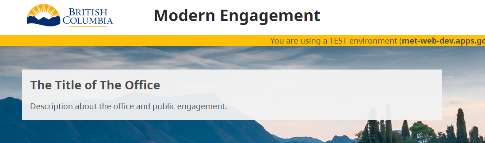

# Setting up a new Tenant

1. To start, insert a record into the tenant table using the following SQL statement:

      INSERT INTO met.tenant(created_date, id, short_name, name, description, title) VALUES (CURRENT_TIMESTAMP, new_id, 'Tenant_short_name', 'Tenant_name', 'Tenant_description', 'Tenant_title');

2. After inserting the record, a new tenant site with default texts will be available. You can access the tenant-specific URL by appending 'Tenant_short_name' to the end of the 'met' URL.

3. The details displayed in the image below are sourced from the default file located at '../met-web/src/locales/en/default.json'. For a new tenant, you can create a tenant-specific text localization file to accommodate any hardcoded text required for that particular tenant.

      

4. In Keycloak, there is a group named 'INSTANCE_ADMIN.' Users who belong to this group have permissions to manage user access and reassign users across all tenants.